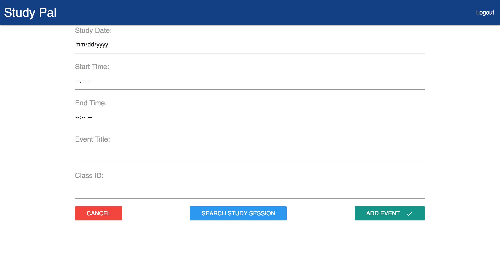

# Study Pal

<table>
<tr>
<td>
  A Full Stack Progressive web app using React to build the user interfaces. This allows the use of data being changed without reloading the page. Study Pal intends to solve the problem that students do not know each others availability to form study groups. Study Pal provides students with a platform to search/join or create study groups.
</td>
</tr>
</table>

## Demo

Here is a working live demo : http://fresnostate-smartapp.herokuapp.com/

## Site

### Landing Page

Currently using Google OAuth single sign on.

### Calendar View

### Adding/Searching Study Groups

 

## Mobile support

The Study Pal App is built as a PWA making it compatible with devices of all
sizes, and consistent improvements are being made.

 

## [Usage](http://fresnostate-smartapp.herokuapp.com/)

### Development

Want to contribute? Great!

To fix a bug or enhance an existing module, follow these steps:

* Fork the repo
* Create a new branch (`git checkout -b improve-feature`)
* Make the appropriate changes in the files
* Add changes to reflect the changes made
* Commit your changes (`git commit -am 'Improve feature'`)
* Push to the branch (`git push origin improve-feature`)
* Create a Pull Request

### Bug / Feature Request

If you find a bug (the website crashed when adding or matching events/ or gave
undesired results), kindly open an issue
[here](https://github.com/FresnoState/smartstudypalapp/issues/new) by including
your input and the expected result.

If you'd like to request a new function, feel free to do so by opening an issue
[here](https://github.com/FresnoState/smartstudypalapp/issues/new). Please
include sample input and their corresponding results.

## Built with

* React
* Node.js
* Express.js
* MongoDB

## Current Features

* Fresno State Account Log in
* Add Study Groups
* Search Study Groups
* Join / Leave Study Groups

## To-do

* Export Events to Google Calendar
* AI based study group matching
* Study Room Booking

## Team

|  |
| -------------------------------------------------------------------------------------------------------------------- |
| [Carlos Daccarett ](https://github.com/cdaccarett93)                                                                 |

## [License](https://github.com/FresnoState/smartstudypalapp/blob/master/LICENSE.md)
